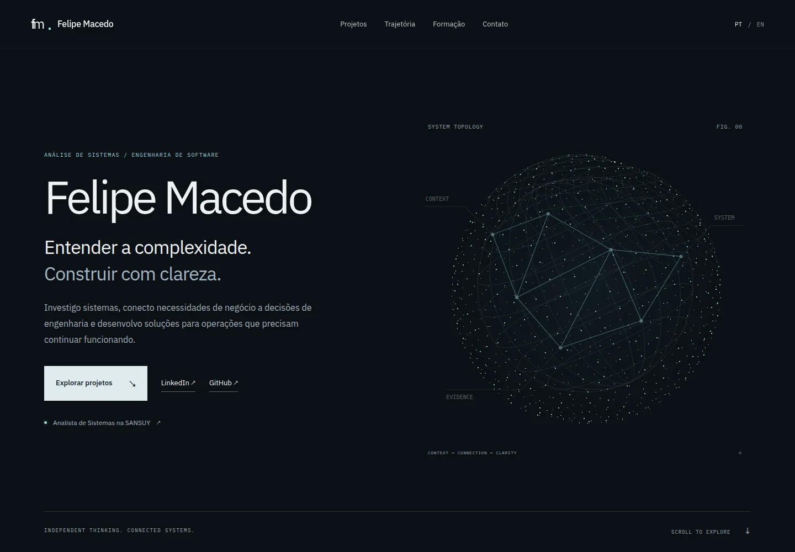

# Felipe Macedo — Personal portfolio

Personal portfolio for systems analysis, business software, integrations and development. It presents Felipe's professional background, selected personal projects, current studies and verified credentials without treating personal experiments as professional production experience.

**Production domain:** [felipemacedo.me](https://felipemacedo.me) · **Hosting:** GitHub Pages only · **Recurring infrastructure cost:** R$ 0.



## Run locally

Node 24 is the CI baseline (Node >=22.12 supported). Install from the lockfile:

```sh
npm ci
npm run dev
```

Open `http://localhost:4321`. Build and inspect the actual static output:

```sh
npm run lint
npm test
npm run build
npm run preview
```

`dist/` contains complete HTML, CSS, JavaScript, fonts, badge images, social artwork, sitemap, robots and CNAME. No Node server, API route, database, serverless function, paid CDN or credentials are needed in production. No visitor tracking is installed. All rendered assets are served from this repository.

## Architecture

Astro renders pages at build time. TypeScript handles optional interactions. Three.js is a lazy chunk, not a prerequisite for rendering content. No React or client hydration framework is used. See [ADR 001](docs/ADR-001.md) and the [source audit](docs/SOURCES.md).

| Location                                | Responsibility                                                    |
| --------------------------------------- | ----------------------------------------------------------------- |
| `src/content/profile.ts`                | Identity, canonical contacts, PT/EN editorial content             |
| `src/content/projects.ts`               | Selected personal projects, current status, limits and links      |
| `src/content/credentials.mjs`           | Nine official Credly badge IDs                                    |
| `src/data/credentials.generated.json`   | Verified, committed fallback snapshot                             |
| `src/content/credential-editorial.json` | Localized descriptions and honest credential taxonomy             |
| `src/content/certificates.json`         | Metadata for supplied visual certificates                         |
| `src/components/`                       | Semantic sections, project views and explanatory SVG diagrams     |
| `src/graphics/scene.ts`                 | One renderer, reusable particles and contextual viewports         |
| `src/scripts/main.ts`                   | Motion preferences, lazy graphics, worker retirement              |
| `src/styles/global.css`                 | Design tokens and responsive layout                               |
| `scripts/`                              | Build validation, Credly sync, original social artwork generation |
| `tests/`                                | Data tests and real-browser smoke/accessibility tests             |

PT-BR is `/`; English is `/en/`. Both are real static routes with canonical and hreflang links. To add Spanish, extend the locale type, add complete versioned copy and project translations, generate `/es/`, and update metadata/sitemap/tests. No runtime translation.

The résumé is a static document at [`/curriculo/`](https://felipemacedo.me/curriculo/) and [`/en/resume/`](https://felipemacedo.me/en/resume/), with the source PDF at `public/cv/Felipe-Macedo-CV-2026.pdf`. Credential detail pages live at [`/credenciais/`](https://felipemacedo.me/credenciais/) and `/en/credentials/`; the home page intentionally shows only a small priority set. Visual certificate evidence stays in `public/certificates/` and is opened from accessible native `<details>` disclosures.

Canonical contacts live only in `src/content/profile.json`. Replace the PDF at the same public path when updating the résumé, preserve its filename and do not copy its phone number into page content. Add a Credly ID to `src/content/credentials.mjs`, run `npm run sync:credly`, review the official snapshot, then add its localized editorial entry by ID. Official Credly metadata and editorial copy are separate by design. Add supplied certificate files without editing them and register their metadata in `src/content/certificates.json`.

## Visual system and graphics

Graphite surfaces, restrained cyan signals, IBM Plex typography, fine rules and generous spacing. Diagrams explain the architecture rather than imply live telemetry. All topology, waveform, graph, mapping and trace artwork is original code; no template, proprietary footage or premium assets.

One persistent WebGL2 canvas follows the active diagram. The same particles change configuration between topology, audio, impact paths, mapping and execution traces. Renderer work stops when the tab is hidden, no diagram is visible, or reduced motion has already drawn a static frame. Mobile uses 380 rather than 850 points, capped DPR 1.25 rather than 1.5, and 30 rather than 45 FPS.

Three.js WebGPURenderer was evaluated; this lightweight point/line scene uses WebGL2 directly for smaller scope and predictable compatibility. **WebGPU is not implemented or required.** If WebGL2, initialization, JavaScript or dynamic imports fail, semantic HTML and original SVGs remain usable. `?no3d` offers a diagnostic fallback. Context loss removes the canvas.

## Accessibility and performance

Native anchors, skip navigation, visible focus, semantic headings, plain links, image dimensions, reduced-motion media query and an explicit motion toggle. There is no scroll hijacking, startup screen or cursor replacement. Core content and language navigation work without JavaScript. An optional `/legacy/` terminal is linked only in the footer; the previous implementation is recoverable at commit `3e0014b` / branch `archive/pre-engineering-redesign`.

Build-enforced gzip budgets: HTML <30 KB per locale; all JavaScript <200 KB; CSS <20 KB. Local fonts and badge images are small, lazy images have dimensions, and no decorative video competes with the LCP. Detailed measurements and testing limits are in [QA.md](docs/QA.md).

## Credly: build-time only

```sh
npm run sync:credly
CREDLY_OFFLINE=1 npm run sync:credly  # Exercise committed fallback
```

The script calls the official public endpoint `/api/v1/public_badges/{id}` observed on Credly's own badge pages. It validates ID, public/accepted state, recipient and issuer, then whitelists name, issuer, description, image, issued/expires dates, skills, type and official URL. Recipient and tracking fields are never stored. Badge images are optimized locally to WebP.

Failures preserve the last valid snapshot **per badge**. An incomplete first-ever snapshot fails explicitly rather than invent credentials. Unknown dates remain `null`; dates are never set to the current day. `checkedAt` is retrieval provenance, not issuance. Titles retain the issuer's wording: an AWS training badge is not AWS Certified. The verified Microsoft credential keeps its actual title.

To add a badge, add its ID, run the sync, review the issuer/recipient/source, commit both JSON and optimized image, and update the snapshot test count. Builds work offline with the existing snapshot; CI attempts a refresh first.

## Add or update a project

Read the source project's README, current status, roadmap and documentation first. Edit `src/content/projects.ts` in both languages. Keep implemented evidence separate from planned scope. Update diagrams only when they improve understanding; never invent latency, confidence percentages or production qualification. Add provenance to `docs/SOURCES.md` and extend route/content checks where needed.

## Validation

```sh
npx playwright install --with-deps chromium
npm run test:e2e
# Optional installed browser:
PLAYWRIGHT_CHROMIUM_EXECUTABLE_PATH=/usr/bin/google-chrome npm run test:e2e
# Optional Lighthouse, while preview is running:
npm run lighthouse
```

Smoke tests scroll all chapters at desktop/notebook/tablet/phone widths; check overflow, errors, keyboard, language, reduced motion, all-local asset requests, GPU failure, JavaScript disabled, axe WCAG A/AA and the optional terminal. Build validation checks every local route/asset/anchor and CNAME. `npm run format:check` checks source formatting.

## GitHub Pages deployment

`.github/workflows/pages.yml` runs checkout → Node 24 → npm ci → Credly sync → lint → data tests → static build → Chromium smoke tests → upload **dist/**. Deployment runs only on `main`, after validation, using the GitHub Pages environment and official Actions. PRs validate without publishing. The `GITHUB_TOKEN` stays in Actions, never in browser code.

The repository must use **Settings → Pages → Source → GitHub Actions** (`build_type: workflow`). Before merging the migration, verify this setting; the audit initially found `legacy` publication. Preserve `felipemacedo.me` in both root CNAME and `public/CNAME`, and confirm it exists in `dist/CNAME`. Never upload the source root after introducing this build.

The retirement worker at `/sw.js` removes only the old portfolio cache names, unregisters itself, and avoids leaving repeat visitors on stale terminal pages. A new PWA/manifest is intentionally unnecessary.

## Assets and licenses

Site code: [MIT](LICENSE). Three.js: MIT. Astro: MIT. IBM Plex Sans/Mono via Fontsource: SIL Open Font License; licenses are shipped in `public/licenses/`. Icons and diagrams are original SVG paths. Portrait is Felipe's existing growthfolio image, resized without facial alterations. Credly badges remain the intellectual property of their issuers and are displayed only to identify their linked public credentials. See [THIRD_PARTY_NOTICES.md](THIRD_PARTY_NOTICES.md).
